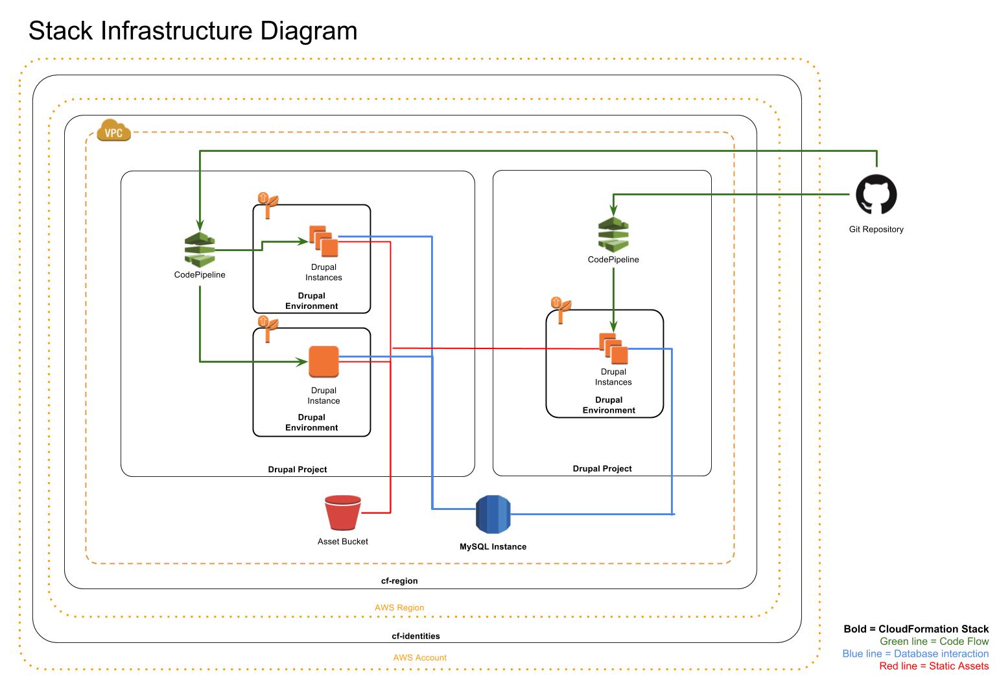

NEMAC CloudFormation
--------------------

[User Documentation](../readme.md)

## Terms

Term|Definition
---|---
**Resource**|Anything AWS can create or manage. For example: an S3 bucket, RDS instance, EC2 instance, or a Route53 recordset
**Project**|A project or website that is going to be deployed on AWS.
**Environment**|A single deployment of a single branch of an project.
**Stack**|A set of AWS resources created using a CloudFormation template.
**Change Set**|A preview of the changes that will result from updating a stack.

## Stack Types

### <a target="_blank" href="https://console.aws.amazon.com/cloudformation/home?region=us-east-1#/stacks/new?stackName=cf-identities&templateURL=https://s3.amazonaws.com/nemac-cloudformation/master/templates/cf-identities.yaml">CloudFormation Identities</a>
Sets up basic IAM Roles and Groups and a KMS key for this AWS Account. The very first stack to be created on any AWS Account. Don't mess with this unless you know what you're doing.
### <a target="_blank" href="https://console.aws.amazon.com/cloudformation/home?region=us-east-1#/stacks/new?stackName=cf-region&templateURL=https://s3.amazonaws.com/nemac-cloudformation/master/templates/cf-region.yaml">Drupal Region</a>
Provides buckets and network resources for this region's CloudFormation Drupal Stacks. Depends on `cf-identities`.
### <a target="_blank" href="https://console.aws.amazon.com/cloudformation/home?region=us-east-1#/stacks/new?stackName=drupal-mysql56&templateURL=https://s3.amazonaws.com/nemac-cloudformation/master/templates/mysql-instance.yaml">MySQL Instance</a>
A MySQL RDS instance which can be used by other stacks. Depends on `cf-region`.
### <a target="_blank" href="https://console.aws.amazon.com/cloudformation/home?region=us-east-1#/stacks/new?stackName=someproject-com&templateURL=https://s3.amazonaws.com/nemac-cloudformation/master/templates/drupal-project.yaml">Drupal Project</a>
A ElasticBeanstalk-based Drupal project which can have many environments. Depends on `cf-region`.
### <a target="_blank" href="https://console.aws.amazon.com/cloudformation/home?region=us-east-1#/stacks/new?stackName=someproject-com-1&templateURL=https://s3.amazonaws.com/nemac-cloudformation/master/templates/drupal-environment.yaml">Drupal Environment</a>
A ElasticBeanstalk-based environment which supports automated deployment of Drupal projects. Depends on `cf-region`, `drupal-project`, and `mysql-instance`

## Stack Infrastructure diagram:

## Setup on a fresh AWS account
1. Create a KMS Key
2. Run the first-run.sh script
3. Verify that the bucket is created and populated, and that the lambda functions were created.
3. Deploy a cf-identities stack.
4. Deploy a cf-region stack.

## Gotcha's
* While CloudFormation itself is very fast, each AWS resource will add its own creation time. For example, RDS Instances do a full backup upon creation, which can easily take 10 minutes even on small instances and stalls the stack creation until complete. I recommend refilling your coffee during those 10 minutes.
* `!ImportValue` works fine if given a string, but for substitutions (`!Sub`) you must use the long format. Ex: `{'Fn::ImportValue': !Sub 'example-${AWS::StackName}'}`
* Sometimes a failed creation or deletion will hang (especially if a resource is deleted outside of CloudFormation), but using `aws cloudformation delete-stack --stack-name NAME --retain-resources` will usually delete it immediately. If that doesn't work, wait 10 minutes and the stack will go to a "FAILED" status and should be able to be deleted using the command above.
* CodePipeline must be manually told to retry failed deployments for unknown reasons.
* Elastic Beanstalk Environments are normally very stable, but in the event of an instance being terminated, it can take up to 10 minutes for a new instance to be fully provisioned, and an hour or more for DNS changes to propogate in the case single-instance environment. That said, sometimes the best way to get a failing environment back to stable is to terminate the offending instances and let EB start fresh on a new instance.
* Avoid the CloudFormation Designer, it's largely useless apart from making rough diagrams.

## Further reading
- [AWS CLI config reference](https://docs.aws.amazon.com/cli/latest/userguide/cli-chap-getting-started.html#cli-quick-configuration)
- [All CloudFormation Resource Types](https://docs.aws.amazon.com/AWSCloudFormation/latest/UserGuide/aws-template-resource-type-ref.html)
- [CloudFormation built-in functions](https://docs.aws.amazon.com/AWSCloudFormation/latest/UserGuide/intrinsic-function-reference.html)
- [CloudFormation built-in variables](https://docs.aws.amazon.com/AWSCloudFormation/latest/UserGuide/pseudo-parameter-reference.html)
- [CloudFormation Resource Attributes](https://docs.aws.amazon.com/AWSCloudFormation/latest/UserGuide/aws-product-attribute-reference.html)
- [CloudFormation Outputs, Exports, and Cross-Stack references](https://docs.aws.amazon.com/AWSCloudFormation/latest/UserGuide/outputs-section-structure.html)