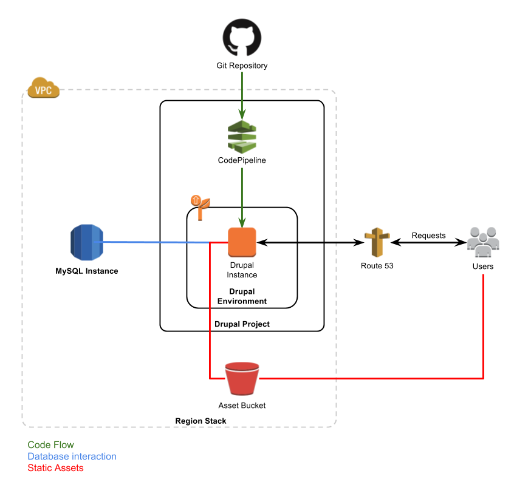
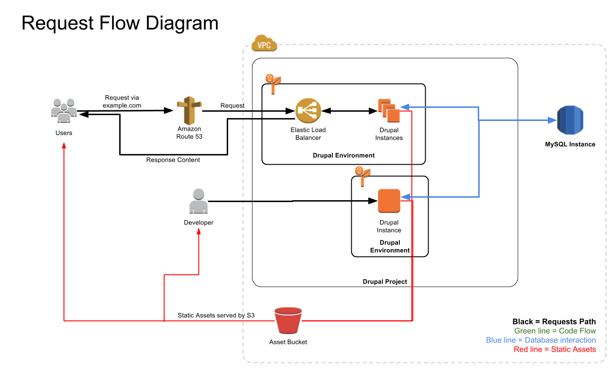

NEMAC CloudFormation
--------------------

**CloudFormation** is a tool used to manage AWS resources using parameterized template files. This allows non-technical users to setup and deploy applications into controlled, replicable, and disposable environment. When a template is deployed the resources it creates are collectively called a **stack**. Stacks can be created (new resources are provisioned for the first time), updated (existing resources are created, changed, swapped, or deleted as needed), and deleted at the click of a few buttons or commands. Mostly you will be interested in Project stacks and Environment stacks. (Note that each Project stack includes an Elastic Beanstalk Application and therefore when AWS refers to an "Application" they really are talking about our "Project" stack)

## Table of Contents
* [Stack Types](stack-types)
* [Background Information](#background)
    * [Infrastructure Overview](#infrastructure)
    * [Request Flow](#request-flow)
    * [Terms](#terms)
* [Usage](#usage)
    * [Starting a new project](#new-project)

## Stack Types

- <a target="_blank" href="https://console.aws.amazon.com/cloudformation/home?region=us-east-1#/stacks/new?stackName=cfn-identities&templateURL=https://s3.amazonaws.com/nemac-cloudformation/master/templates/cfn-identities.yaml">**CloudFormation Identities**</a> -
Sets up basic IAM Roles and Groups and a KMS key for this AWS Account. The very first stack to be created on any AWS Account. Don't mess with this unless you know what you're doing.
- <a target="_blank" href="https://console.aws.amazon.com/cloudformation/home?region=us-east-1#/stacks/new?stackName=cfn-region&templateURL=https://s3.amazonaws.com/nemac-cloudformation/master/templates/cfn-region.yaml">**CloudFormation Region**</a>
Provides buckets and network resources for this region's CloudFormation Drupal Stacks. Depends on `cfn-identities`. If `cf-identities` already exists in another region, <a target="_blank" href="https://console.aws.amazon.com/cloudformation/home?region=us-east-1#/stacks/new?stackName=cfn-region&templateURL=https://s3.amazonaws.com/nemac-cloudformation/master/templates/cfn-identities-secondary-region.yaml">create a `cf-identities-secondary-region` stack first</a>.
- <a target="_blank" href="https://console.aws.amazon.com/cloudformation/home?region=us-east-1#/stacks/new?stackName=drupal-mysql56&templateURL=https://s3.amazonaws.com/nemac-cloudformation/master/templates/mysql-instance.yaml">**MySQL Instance**</a>
A MySQL RDS instance which can be used by other stacks. Depends on `cfn-region`.
- <a target="_blank" href="https://console.aws.amazon.com/cloudformation/home?region=us-east-1#/stacks/new?stackName=someproject-com&templateURL=https://s3.amazonaws.com/nemac-cloudformation/master/templates/drupal-project.yaml">**Drupal Project**</a>
A ElasticBeanstalk-based Drupal project which can have many environments. Depends on `cfn-region`.
- <a target="_blank" href="https://console.aws.amazon.com/cloudformation/home?region=us-east-1#/stacks/new?stackName=someproject-com-1&templateURL=https://s3.amazonaws.com/nemac-cloudformation/master/templates/drupal-environment.yaml">**Drupal Environment**</a>
A ElasticBeanstalk-based environment which supports automated deployment of Drupal projects. Depends on `cfn-region`, `drupal-project`, and `mysql-instance`

## Background Information

### Infrastructure Overview
The diagram below illustrates the interactions between the major components of two Drupal projects with varying types of environments.

### Request Flow
Below is a rough diagram showing the differences between production and development environments.

### Terms
Term|Definition
---|---
**Resource**|Anything AWS can create or manage. For example: an S3 bucket, RDS instance, EC2 instance, or a Route53 recordset
**Project**|A project or website that is going to be deployed on AWS.
**Environment**|A single deployment of a single branch of an project.
**Stack**|A set of AWS resources created using a CloudFormation template.
**Change Set**|A preview of the changes that will result from updating a stack (not required to apply an update).

## Usage

### Migrating an existing site into CloudFormation/Elastic Beanstalk

1. Identify the site’s directory on the existing server, database name, url, and git repository (create git repository if none exists presently)
2. Backup the site’s directory using `tar czf sitename.tgz sitedirectory`
3. Dump the site’s database using `sudo mysqldump --default-character-set=utf8 --databases sitedatabasename > sitename.sql`
4. Move the backup tar and sql files to your development machine. (using scp this would be something like `scp server:/path/to/sitename.tgz ./` on your local machine.)
5. Import the database to the active RDS MySQL instance:
    - Add your public IP address to the "dev-whitelist-region" security group's inbound rules ([Security Group Console](https://console.aws.amazon.com/ec2/v2/home?region=us-east-1#SecurityGroups:search=dev-whitelist;sort=desc:tag:Name))
    - Then connect to the RDS instance's endpoint ([RDS Console](drrjrgarfcq13p.cj0oborxdlge.us-east-1.rds.amazonaws.com)) using your favorite MySQL client (MySQL Workbench works well and is free)
    - Import the database that you exported in step 3.
    - Note the database name as you will need it on step 10.
5. Untar the project source into a directory using `tar xzf sitename.tgz`.
6. Move the project `project/html/` directory's contents to the root of your project directory. Delete the project/html folder.
7. Pull the drupal project template files into the project directory using `git pull https://github.com/jwilson8767/nemac-drupal-template.git
`. This will overwrite some files and include the files that help configure the Elastic Beanstalk environment. Additionally, this adds the `s3fs` Drupal module (and its dependencies), which is what offloads static assets to S3 and allows the webserver to be stateless.
8. Commit all the files in the project directory to a new branch, push that branch to the project's GitHub repository.
9. <a target="_blank" href="https://console.aws.amazon.com/cloudformation/home?region=us-east-1#/stacks/new?stackName=someproject-com&templateURL=https://s3.amazonaws.com/nemac-cloudformation/master/templates/drupal-project.yaml">Click here to create a new Drupal Project stack.</a>
10. <a target="_blank" href="https://console.aws.amazon.com/cloudformation/home?region=us-east-1#/stacks/new?stackName=someproject-com-1&templateURL=https://s3.amazonaws.com/nemac-cloudformation/master/templates/drupal-environment.yaml">Click here to create a new Drupal Environment stack.</a> Enter your github information as needed (You should generate a personal access token with `repo` access). Make sure to enter the correct branch. If this environment will go into production at any poind check "Retain Database" to ensure it is not cleaned up with the rest of the environment when it is deleted. The environment will take a few minutes to spin up and deploy, grab some coffee.
11. Your environment should not be ready and functional. Connect to it using the link given in the output of the environment stack (or the Elastic Beanstalk console). Note that https is not yet implemented and that this section does not cover using Route53 to direct traffic to your environment.

### Starting a new project
1. Get your project ready:
    - [Install Git](https://git-scm.com/downloads) on the computer you will be developing with.
    - (optional) [Install the AWS CLI](https://aws.amazon.com/cli/), [generate your access key](), and use `aws configure` to enter your access key to make it easier to manage stacks later on.
2. Create your new project:
    - Create a GitHub repository for your project, then clone it into a local directory.
    <!--  TODO Update this link when the template project files have a repository -->
    - Copy the template project files into your project directory using `git archive --format=tar --remote=<repository URL> HEAD | tar xf -`
    - Commit your code to the github repository using `git add --all && commit -m "template" && push origin master`
3. <a target="_blank" href="https://console.aws.amazon.com/cloudformation/home?region=us-east-1#/stacks/new?stackName=someproject-com&templateURL=https://s3.amazonaws.com/nemac-cloudformation/master/templates/drupal-project.yaml">Click here to create a new Drupal Project stack.</a>
4.
5. When the environment stack creation completes, copy the EB Domain Name from the Outputs panel to your address bar, then add `/user` to login to your drupal environment.
6.

### Cloning the production environment to develop in a safe environment.
Do this if you have a branch you want to experiment with, test new updates to Drupal, or just develop in your own space without disrupting the production environment. Later you can either commit your changes to the master branch of the project's github repository(at which point the changes will be automatically deployed to the production environment) or [assign your new environment as the production environment for the Application stack](#replace-production-environment).

### Deleting stacks
Deleting a stack is usually super easy: Just use the `Delete Stack` button in CloudFormation. However, first you must delete dependant stacks. For example, before you can delete an Application stack, you have to delete all of the Environment stacks that depend on it. If a deletion fails, you can try using `aws cloudformation delete-stack --stack-name "<Stack Name>" --retain-resources`, but then you will have to manually clean up all of the resources left behind.

### Development/CLI usage Requirements

- [Git](https://git-scm.com/downloads)
- Python 2.7+ (Python 3 is not yet supported by AWS Lambda)
- [AWS CLI](https://github.com/aws/aws-cli) - `pip install awscli` followed by `aws configure` to enter your default region (usually `us-east-1`) and your AWS access key
- [Kappa](https://github.com/garnaat/kappa) - `pip install git+https://github.com/garnaat/kappa.git` (automated Lambda function deployment)
- [AWS CloudFormation CLI](https://github.com/Kotaimen/awscfncli) - `pip install awscfncli` (automated CloudFormation stack deployment)

## Deploy on a fresh AWS Account
1. Create a new KMS key.
2. Update all kappa.yml files with the new KMS Key Arn.
3. Use `deploy-customresources.sh` to build and deploy all custom resources.
4. Run `deploy-templates.sh bucket-name` (bucket will be created if it doesn't already exist)
5. Verify that the bucket is created and populated, and that the lambda functions were created.
6. Deploy a <a target="_blank" href="https://console.aws.amazon.com/cloudformation/home?region=us-east-1#/stacks/new?stackName=cfn-identities&templateURL=https://s3.amazonaws.com/nemac-cloudformation/master/templates/cfn-identities.yaml">CloudFormation Identities stack</a> using the new KMS key arn. (see "[deploying stacks via CLI](#deploy-via-cli)")
7. Deploy a <a target="_blank" href="https://console.aws.amazon.com/cloudformation/home?region=us-east-1#/stacks/new?stackName=cfn-region&templateURL=https://s3.amazonaws.com/nemac-cloudformation/master/templates/cfn-region.yaml">Cloudformation Region stack</a> (making sure to use the newly created `cloudformation-role`).

At this point the account is ready for MySQL instances and Drupal Projects.

## Deploying stacks via CLI
1. Customize the appropriate example deployment config with values. (example files located in deployments directory)
2. Deploy using `cfn stack deploy <path to deployment config>`, the stack will be created and stack events will be printed out to your console as resources are created.
3. When you are done you can remove the stack using `cfn stack delete <path to deployment config>`

## Gotcha's
* While CloudFormation itself is very fast, each AWS resource will add its own creation time. Here are a few that add a notable delay:
    * RDS Instances do a full backup upon creation, which can easily take 10 minutes even on small instances.
    * EC2 Instance Profiles wait exactly 2 minutes to allow for propagation.
    * EC2 instances can take 5+ minutes to spin up.
* `!ImportValue` works fine if given a string, but for substitutions (`!Sub`) you must use the long format. Ex: `{'Fn::ImportValue': !Sub 'example-${AWS::StackName}'}`
* Sometimes a failed creation or deletion will hang (especially if a resource is deleted outside of CloudFormation), but using `aws cloudformation delete-stack --stack-name NAME --retain-resources` will usually delete it immediately. If that doesn't work, wait 10 minutes and the stack will go to a "FAILED" status and should be able to be deleted using the command above.
* CodePipeline must be manually told to retry failed deployments for unknown reasons.
* Elastic Beanstalk Environments are normally very stable, but in the event of an instance being terminated, it can take up to 10 minutes for a new instance to be fully provisioned. That said, sometimes the best way to get a failing environment back to stable is to terminate the offending instances and let EB start fresh on a new instance.
* Avoid the CloudFormation Designer, it's useless and creates buckets for no reason.

## General Troubleshooting
#### Failure to deploy changes from Github:
Login to the AWS Elastic Beanstalk Console, review the event log or download full logs to diagnose and resolve the issue, when your fixes are ready use the AWS CodePipeline console to "Release" which will re-run the deployment.
#### Http 500
Usually this is an application-level bug, so first check your Drupal configuration. Additionally, the AWS Elastic Beanstalk console will provide you with error logs that may be helpful.
#### No-response (timeout)
Verify the DNS entries are correct for the domain you are attempting to visit, then verify that the Elastic Beanstalk environment has a running instance, then review the logs for the environment.
#### Failure to build new Elastic Beanstalk Environment from template
If a stack fails to deploy, first review its logs as often they will say exactly which resource failed. If the resource is in another stack, then troubleshoot that stack/resource directly, if it is part of the stack that failed to deploy then the issue may be in the parameters supplied when creating the new stack. Re-create the stack with corrected parameters. If that still doesn't work then troubleshoot the template directly to resolve issues with the specific resource that is failing.

## Further reading
- [AWS CLI config reference](https://docs.aws.amazon.com/cli/latest/userguide/cli-chap-getting-started.html#cli-quick-configuration)
- [All CloudFormation Resource Types](https://docs.aws.amazon.com/AWSCloudFormation/latest/UserGuide/aws-template-resource-type-ref.html)
- [CloudFormation built-in functions](https://docs.aws.amazon.com/AWSCloudFormation/latest/UserGuide/intrinsic-function-reference.html)
- [CloudFormation built-in variables](https://docs.aws.amazon.com/AWSCloudFormation/latest/UserGuide/pseudo-parameter-reference.html)
- [CloudFormation Resource Attributes](https://docs.aws.amazon.com/AWSCloudFormation/latest/UserGuide/aws-product-attribute-reference.html)
- [CloudFormation Outputs, Exports, and Cross-Stack references](https://docs.aws.amazon.com/AWSCloudFormation/latest/UserGuide/outputs-section-structure.html)